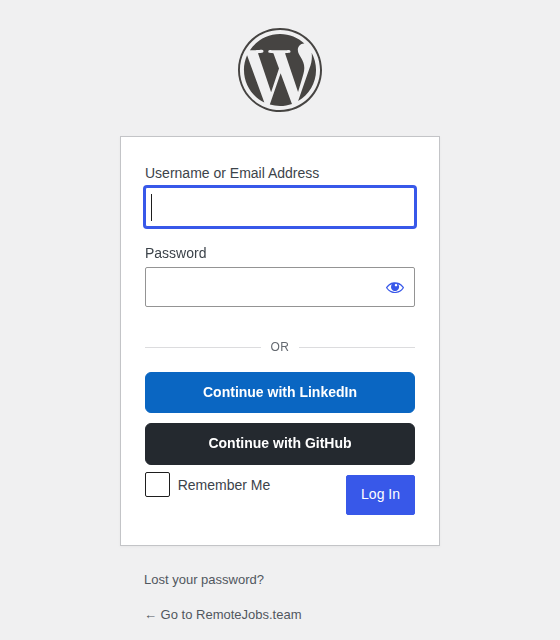
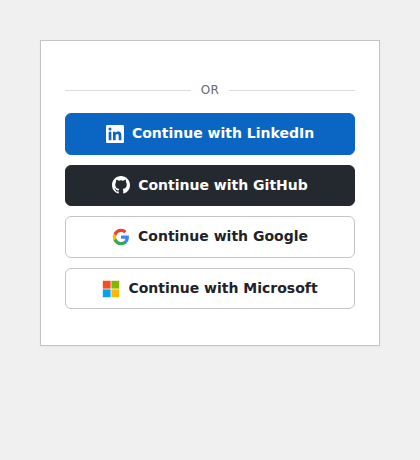

# WP OAuth Connect

Generic **OAuth transport + identity-linking layer** for WordPress.

It owns the boring, security-sensitive plumbing — provider engines,
`/oauth/{provider}/start|callback` routes, HMAC-signed CSRF state, provider-ID ↔
WP-user linking, and a documented `woc_*` hook contract. It deliberately does
**not** ship a registration policy or a login UI: those belong to a *companion
application plugin* (e.g. `remotejobs-core`) that opts in through the hooks
below. The result is a thin, self-contained core you can drop into any site and
wire up to your own app.

- **Works out of the box:** activate, add one provider's credentials, done —
  styled "Continue with …" buttons appear on the standard WordPress login screen
  with no companion plugin, theme edits, or shortcodes.
- **Requires:** WordPress 6.4+, PHP 8.3+
- **Engines:** OAuth2 + OIDC, with shipped presets for GitHub, Google, LinkedIn,
  and Microsoft — each with its own brand-icon button — plus one
  admin-configurable custom OIDC slot.
- **Full hook reference:** [`docs/hooks.md`](docs/hooks.md)

---

## Works out of the box

Three steps to working social login — no code, no companion plugin:

1. Activate **WP OAuth Connect**.
2. On **Settings → OAuth Connect**, paste a provider's Client ID + Secret and
   tick *Enable*.
3. Open your login screen — the **"Continue with …"** button is already there.

That's it. The buttons render on the **standard WordPress login form**, styled
and carrying each provider's brand icon, with no theme edits or shortcodes.



All four built-in providers ship a ready-made, brand-coloured icon button — the
moment you enable one it looks finished:



### Compatible with relocated login URLs

The buttons are rendered through WordPress's own login-form hooks
(`login_form` + `login_enqueue_scripts`), **not** by sniffing the request URL.
That means they keep working when the login page is moved off `wp-login.php` by
**WPS Hide Login**, a custom login slug, or any mu-plugin that relocates the
form — those serve the genuine `wp-login.php`, which still fires these hooks
wherever it is mounted. The `/oauth/*` routes are rewrite rules and are likewise
independent of the login URL.

A companion plugin that renders its own login UI can suppress the built-in
buttons with one filter:

```php
add_filter('woc_oauth_render_login_form', '__return_false');
```

---

## How it plugs into native WordPress login

WP OAuth Connect does **not** replace WordPress authentication — it *feeds* it.

When a provider callback succeeds, the plugin logs the member in with the
standard WordPress session primitives:

```php
wp_set_auth_cookie($user->ID, true, is_ssl());
wp_set_current_user($user->ID);
```

That means an OAuth sign-in produces the **exact same authenticated session** as
a username/password login at `wp-login.php`: same auth cookies, same
`current_user_can()`, same `is_user_logged_in()`. Roles and capabilities are
untouched — a user created via OAuth gets the site's `default_role` (or whatever
your companion's `woc_oauth_create_user` returns).

Native password login keeps working alongside it. The plugin exposes a single
**native-login toggle** so a companion that runs its own login page can hide its
password / magic-link UI when the operator wants OAuth-only auth:

```php
if (oauth_native_login_enabled()) {
    // render the password form
}
```

The toggle lives on **Settings → OAuth Connect** and is also readable/overridable
via `woc_oauth_native_login_enabled`. The core itself never disables
`wp-login.php`; controlling that is the companion's call.

### Decision tree on callback

Every successful `/oauth/{provider}/callback` runs the same branch logic
(`OAuthService::callback()`):

1. **Provider already linked** → log that user in. (`woc_oauth_authenticated`)
2. **Email matches an existing WP user, no link yet** → redirect to the
   **BIND-PROMPT** to prove ownership before linking. See
   [Connecting existing accounts](#connecting-existing-accounts).
3. **Brand-new identity** → ask the companion via `woc_oauth_allow_registration`
   (default **`false`**). If allowed, `woc_oauth_create_user` builds the user
   (or the core creates a minimal one); then link + log in.
   (`woc_oauth_user_registered`)
4. **Rejected** → `woc_oauth_registration_rejected` fires and the user sees a
   403 with a message you can override (`woc_oauth_reject_message`).

---

## Installation

1. Symlink or copy into `wp-content/plugins/wp-oauth-connect/`.
2. Run `composer install` in the plugin directory (PSR-4 autoload).
3. Define per-provider client credentials in `wp-config.php` (see below).
   `OAUTH_STATE_KEY` is auto-written to `wp-config.php` when the file is
   writable; otherwise it's shown on **Settings → OAuth Connect** to paste in.
4. Activate the plugin and enable providers on **Settings → OAuth Connect**.

```php
// wp-config.php
define('OAUTH_GITHUB_CLIENT_ID',     '…');
define('OAUTH_GITHUB_CLIENT_SECRET', '…');
define('OAUTH_GOOGLE_CLIENT_ID',     '…');
define('OAUTH_GOOGLE_CLIENT_SECRET', '…');
// OAUTH_STATE_KEY is generated for you on first run.
```

### Routes

| Path | Purpose |
| --- | --- |
| `/oauth/{slug}/start` | Sign state, set CSRF cookie, redirect to the provider |
| `/oauth/{slug}/callback` | Verify state, exchange code, run the decision tree |
| `/oauth/bind` | BIND-PROMPT after an email collision |

### Public helper functions

These are the stable, read-only functions a companion plugin or theme may call:

```php
oauth_providers(): array;                                   // [{slug, label, enabled}, …]
oauth_start_url(string $provider, array $context = []): string;  // $context: invite, next
oauth_provider_enabled(string $provider): bool;
oauth_native_login_enabled(): bool;
```

---

## Using it from a companion plugin

### 1. Render "Sign in with …" buttons

Ask the core for the operational providers and build links. `oauth_start_url()`
accepts an `invite` token and a same-host `next` redirect.

```php
foreach (oauth_providers() as $provider) {
    if (!$provider['enabled']) {
        continue;
    }
    printf(
        '<a class="oauth-btn oauth-btn--%1$s" href="%2$s">%3$s</a>',
        esc_attr($provider['slug']),
        esc_url(oauth_start_url($provider['slug'], ['next' => '/directory'])),
        esc_html(sprintf(__('Continue with %s', 'your-plugin'), $provider['label']))
    );
}
```

Prefer the curated button descriptors? Read them from the `woc_oauth_login_buttons`
filter — the core fills it with operational providers in the admin-configured
order, each entry exposing `provider`, `label`, `url`, `css_class`, `enabled`,
and `icon_html`:

```php
$buttons = apply_filters('woc_oauth_login_buttons', [], ['next' => '/directory']);
foreach ($buttons as $button) {
    printf(
        '<a class="%1$s" href="%2$s">%3$s<span>%4$s</span></a>',
        esc_attr($button['css_class']),
        esc_url($button['url']),
        $button['icon_html'],            // pre-sanitised SVG/markup
        esc_html($button['label'])
    );
}
```

### 2. The native `wp-login.php` screen — already done

You don't need to wire anything here: the core renders the operational provider
buttons on `wp-login.php` for you (see [Works out of the box](#works-out-of-the-box)).
Your jobs are only to (a) opt out if you render your own login UI, and/or (b)
restyle:

```php
// (a) Suppress the built-in buttons because your plugin renders its own.
add_filter('woc_oauth_render_login_form', '__return_false');

// (b) Keep the buttons but drop the shipped CSS and style them yourself.
add_action('login_enqueue_scripts', function (): void {
    wp_dequeue_style('woc-oauth-login');
}, 20);
```

If you *do* render your own login surface (a custom page, a widget, a block),
build it from the same public helpers:

```php
foreach (oauth_providers() as $provider) {
    if (!$provider['enabled']) {
        continue;
    }
    printf(
        '<a class="oauth-btn oauth-btn--%1$s" href="%2$s">%3$s</a>',
        esc_attr($provider['slug']),
        esc_url(oauth_start_url($provider['slug'])),
        esc_html(sprintf(__('Sign in with %s', 'your-plugin'), $provider['label']))
    );
}
```

### 3. Decide who is allowed to register, and how the user is built

Registration is **off by default**. A companion opts in (e.g. "valid invite
only") and supplies its own user-creation logic so the new account lands in your
domain model, not just `wp_insert_user`.

```php
// Allow sign-up only when the signed state carries a valid invite token.
add_filter('woc_oauth_allow_registration', function (bool $allowed, $profile, array $payload): bool {
    $inviteToken = $payload['invite_token'] ?? '';
    return $inviteToken !== '' && InviteService::isRedeemable($inviteToken);
}, 10, 3);

// Build the member through your own service; return a WP_User.
// Returning null lets the core create a minimal subscriber instead.
add_filter('woc_oauth_create_user', function (?WP_User $user, $profile, array $payload): ?WP_User {
    return SignupService::createFromOAuth(
        email:       $profile->email,
        displayName: $profile->displayName,
        invite:      $payload['invite_token'] ?? null
    );
}, 10, 3);
```

Pass the invite into the flow when you build the start URL —
`oauth_start_url('github', ['invite' => $token])` — and add it to the signed
state so it survives the round-trip:

```php
add_filter('woc_oauth_state_payload', function (array $payload, string $slug, array $context): array {
    if (!empty($context['invite'])) {
        $payload['invite_token'] = $context['invite'];
    }
    return $payload;
}, 10, 3);
```

### 4. Control the post-auth redirect

```php
add_filter('woc_oauth_redirect_url', function (string $url, WP_User $user, $profile, array $payload, string $flow): string {
    // $flow is one of: 'login' | 'signup' | 'bind'
    return $flow === 'signup' ? home_url('/welcome') : $url;
}, 10, 5);
```

### 5. React to auth events (audit, metrics, onboarding)

```php
add_action('woc_oauth_authenticated',   fn(WP_User $u, $profile) => Audit::log('oauth.login',  $u->ID), 10, 2);
add_action('woc_oauth_user_registered', fn(WP_User $u, $profile) => Onboarding::start($u->ID),          10, 2);
add_action('woc_oauth_identity_bound',  fn(WP_User $u, $profile) => Audit::log('oauth.linked', $u->ID), 10, 2);
```

### 6. Add a provider without writing a Provider class

One filter registers a full OIDC provider from a config array:

```php
add_filter('woc_oauth_provider_definitions', function (array $defs): array {
    $defs[] = [
        'slug'   => 'okta-acme',
        'label'  => 'Sign in with Acme SSO',
        'engine' => 'oidc',
        'issuer' => 'https://acme.okta.com/oauth2/default',
        'scopes' => ['openid', 'email', 'profile'],
    ];
    return $defs;
});
// Credentials: OAUTH_OKTA_ACME_CLIENT_ID / OAUTH_OKTA_ACME_CLIENT_SECRET
// Enable on Settings → OAuth Connect (or the woc_oauth_okta-acme_enabled option).
```

---

## Connecting existing accounts

When someone signs in with a provider whose email **already belongs to a WP
user** but isn't linked to that provider yet, the core does *not* silently log
them in or create a duplicate. It runs the **BIND-PROMPT** to prove the person
controls the existing account before stitching the identities together:

1. Callback detects the email collision and redirects to
   `/oauth/bind?token=…` (a short-lived, single-use token).
2. The bind page asks the user to confirm by entering the **password of the
   existing WP account**.
3. On submit, the core verifies the password with `wp_authenticate()`. On
   success it writes the provider link (`AccountLinker::bind()` → usermeta),
   fires `woc_oauth_identity_bound`, logs the user in, and redirects (`$flow =
   'bind'`).
4. Wrong password re-renders the prompt with an error; an expired/used token
   returns HTTP 410.

From then on that provider logs the user straight in (branch 1 of the decision
tree). Customise the flow:

```php
// Reword the prompt (e.g. mention which provider is being linked).
add_filter('woc_oauth_bind_prompt_message', function (string $msg, $profile, WP_User $user): string {
    return sprintf(
        __('An account for %1$s already exists. Enter your password to link %2$s.', 'your-plugin'),
        $user->user_email,
        ucfirst($profile->providerSlug)
    );
}, 10, 3);

// Run your own logic once an identity is linked.
add_action('woc_oauth_identity_bound', function (WP_User $user, $profile): void {
    ProfileService::markProviderConnected($user->ID, $profile->providerSlug);
}, 10, 2);
```

---

## Styling the connect screen

Two surfaces are styleable: the **provider buttons** and the **bind page**. The
core ships no opinionated CSS for the buttons (so it never fights your theme) and
only a minimal inline style on the standalone bind page (so it works with no
companion). Both are fully overridable.

### Provider buttons

Every button carries predictable hooks for CSS: a shared class plus a
per-provider modifier — `oauth-btn oauth-btn--github`, `oauth-btn--google`, etc.
Style them in your theme/companion:

```css
.oauth-btn {
    display: inline-flex; align-items: center; gap: .5rem;
    padding: .625rem 1rem; border-radius: 8px;
    font-weight: 600; text-decoration: none;
    border: 1px solid var(--rjt-border, #d8dde3);
}
.oauth-btn--github   { background: #24292f; color: #fff; }
.oauth-btn--google   { background: #fff;    color: #1f1f1f; }
.oauth-btn--linkedin { background: #0a66c2; color: #fff; }
.oauth-btn__icon     { width: 1.25rem; height: 1.25rem; }
```

To change a button's label, classes, or inject an SVG icon, filter the
descriptor (the `icon_html` you return is rendered as-is, so sanitise it):

```php
add_filter('woc_oauth_provider_button', function (array $button, $provider): array {
    if ($button['provider'] === 'github') {
        $button['icon_html'] = '<svg class="oauth-btn__icon" …></svg>';
        $button['css_class'] .= ' oauth-btn--dark';
    }
    return $button;
}, 10, 2);
```

### The bind page

The standalone bind template (`templates/bind-prompt.php`) is intentionally
plain — a centered card with system fonts and inline styles, so the plugin is
presentable with zero theme integration. For a branded, theme-aware connect
screen, swap the whole template via `woc_oauth_bind_template` (this is exactly
how `remotejobs-core` ships its own version):

```php
add_filter('woc_oauth_bind_template', function (string $default, array $vars): string {
    // $vars: token, message, email, profile (and error on a failed attempt)
    return MY_PLUGIN_DIR . '/templates/oauth-bind.php';
}, 10, 2);
```

Your template receives `$token`, `$message`, `$email`, `$profile`, and `$error`,
and must post the password back to
`home_url('/oauth/bind?token=' . rawurlencode($token))` with a
`woc_bind_password` field. Use `get_header()` / `get_footer()` to inherit your
theme chrome. A minimal branded body:

```php
<?php /* templates/oauth-bind.php */ get_header(); ?>
<main class="auth-card">
    <h1><?php esc_html_e('Confirm your account', 'your-plugin'); ?></h1>
    <?php if (!empty($error)) : ?>
        <p class="auth-card__error"><?php echo esc_html($message); ?></p>
    <?php endif; ?>
    <p><?php echo esc_html($message); ?></p>
    <form method="post" action="<?php echo esc_url(home_url('/oauth/bind?token=' . rawurlencode($token))); ?>">
        <label for="woc_bind_password"><?php esc_html_e('Password', 'your-plugin'); ?></label>
        <input type="password" id="woc_bind_password" name="woc_bind_password" required autocomplete="current-password">
        <button class="oauth-btn oauth-btn--primary" type="submit">
            <?php printf(esc_html__('Link %s account', 'your-plugin'), esc_html(ucfirst($profile->providerSlug))); ?>
        </button>
    </form>
</main>
<?php get_footer();
```

You can also override just the copy without replacing the template, via
`woc_oauth_bind_prompt_message` (shown above) and `woc_oauth_reject_message` for
the 403 rejection page.

---

## Translations

Every user-facing string uses the `wp-oauth-connect` text domain, loaded on
`init`. A translation template ships at
[`languages/wp-oauth-connect.pot`](languages/wp-oauth-connect.pot); drop
`wp-oauth-connect-{locale}.mo` next to it (or in
`wp-content/languages/plugins/`) to localise. Built-in provider button labels
("Continue with GitHub", …) are translatable; internal exception and log
messages are intentionally left untranslated.

## Hook reference

The full filter/action contract — including the custom-provider recipe and the
RemoteJobs.team integration map — lives in [`docs/hooks.md`](docs/hooks.md).

## License

Proprietary © RemoteJobs.team.
